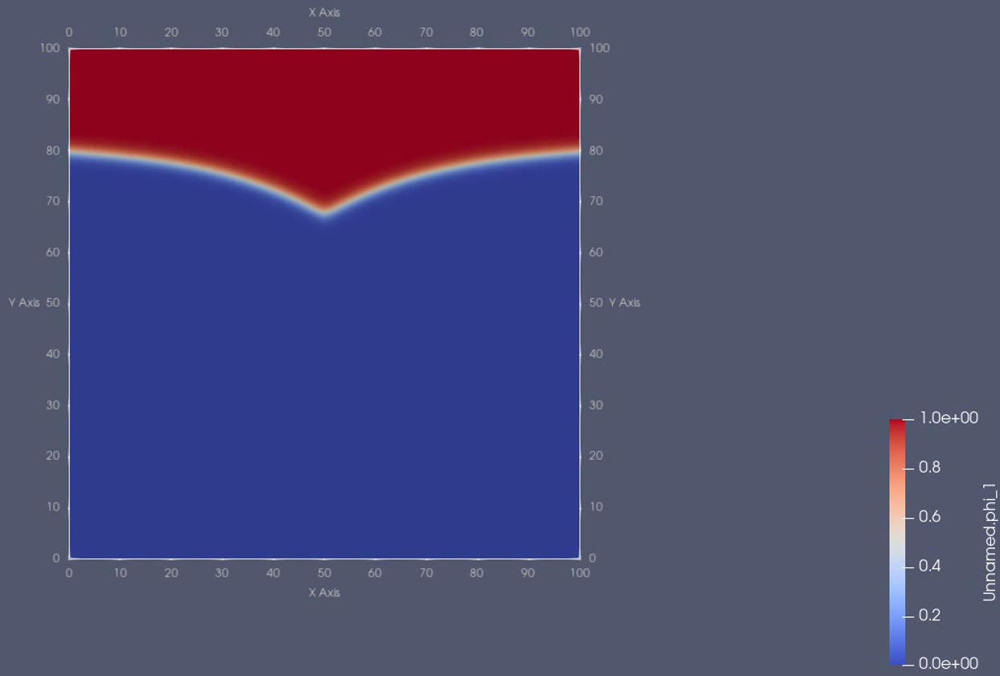

# PhaseFieldPet
PhaseFieldPet is an open-source phase-field simulation software for heterogeneous architectures (such as CPUs and GPUs). It is built on top of [PETSc](https://petsc.org/release/), and hence wide variety of numerical solvers are available at run time. PhaseFieldPet software simulates multiphase-field models (`pfe_mpfl` or `pfe_mpf`) and  multi-order parameter models, also called continuum field models (`pfe_mop`).
In its current version (v1.0.0), PhaseFieldPet comes with three gradient energy terms (`grad_dot`, `grad_weighted`, `grad_interpolated`), five potential energy terms (`pot_toth`, `pot_moelans`, `pot_garacke`,`pot_nestler`, `pot_steinbach`) and three driving forces (`bulk_b0`,`bulk_b1`,`bulk_b2`). Not all combinations give a phsicaly sound simulation, so the user has to experiment with combinations and reason out why. For brief description of PhaseFieldPet, see the associated paper [Chota et al., 2025](paper/paper.pdf). For further details and explanations regarding gradient energy terms, potential energy terms and the phase field equation as presented in PhaseFieldPet, we encourage readers to see the paper [Daubner et al., (2023)](https://doi.org/10.1016/j.commatsci.2022.111995). For explanations  and expressions of bulk driving forces as used in PhaseFieldPet, see [Hoffrogge et al., 2025](https://iopscience.iop.org/article/10.1088/1361-651X/ad8d6f).

PhaseFieldPet runs on wide variety of hardware and it supports:
   - Multicore, Multinode CPUs via MPI (distributed computing capability by default).
   - GPUs ( NVIDIA, AMD): via CUDA, HIP, Kokkos, openCL.
   - Multicore CPUs via OpenMP (using third party package integration with petsc).
   - Pthreads.

## Table of Contents

- [Introduction](#phasefieldpet)
- [Usage](#1-usage)
   - [Installation](#11-installation)
   - [Compile the code](#12-Compile-the-code)

- [For Developers](#2-for-developers)
- [License](#3-license)


#### Static Triple Junction animation

[](Videos/static_Triple_Junction.mp4)

# 1. Usage
  One can take  source code PhaseFieldPet.c, and compile and run it, visualize the results (default in vtk format) using visualizations softwares such as [ParaView](https://www.paraview.org/). The steps to download and install varies, but we give a general directions to do so here.

## 1.1 Installation
There are many ways to install PETSc. See [PETSc Installation](https://petsc.org/release/install/).
#### 1.1.1 From Linux Distribution Repository ( older version )
On debian based such as Ubuntu Linux for instance
  ```bash
  sudo apt install petsc-dev
  ```
#### 1.1.2 From Source ( most updated versions )
Steps to install vary based on what softwares are available in the machine you are connected to. For instance on the system where gcc, g++, gfortran  are available , but not mpi implmentation or lapack, PETSc will install it for you following
```bash
  - git clone -b release https://gitlab.com/petsc/petsc.git petsc
  - cd petsc
  - ./configure --with-cc=gcc --with-cxx=g++ --with-fc=gfortran --download-mpich --download-fblaslapack
  - make all check
```
If in addition you have NVIDIA GPU with compute capability, add `--with-cuda`  in `./configure` above. Do similarly to kokkos , OpenMP or Pthread.\
If your system has mpi installed ( or available, say via `module load openmpi` in HPC machines), find the directory where it is installed ( eg `which mpiexec`), by optionally adding optimization flags, do the following to configure PETSc
```bash
- ./configure PETSC_ARCH=arch-optimized --with-debugging=0  COPTFLAGS='-O3 -march=native -mtune=native'  CXXOPTFLAGS='-O3  -mtune=native'  FOPTFLAGS='-O3 -march=native -mtune=native'  --download-fblaslapack --with-mpi-dir=/Path/to/your/MPI/Dir
```
 Note that  if you installed mpi implmentation with PETSc `mpiexec` or `mpirun` will be available in directory `$PETSC_DIR/$PETSC_ARCH/bin/mpiexec`. You can append `PETSC_DIR` and `PETSC_ARCH` in a start up files (like in `~/.bashrc`) and make an alias to `mpiexec` or put it in your `$PATH` variable for it to be available in every shell you open.


## 1.2 Compile the code
If the `makefile` (`Makefile`) and PhaseFieldPet.c are in one directory, 
  ```bash
     make PhaseFieldPet
  ```

## 1.3 Run your simulation
### 1.3.1 Static Triple Junction Simulation
- Boundary condition in x direction is pinned.
#### On CPU with n # mpi processes
Solve with default time step solver set in the code (Adaptive Runge Kutta Implicit-Explicit) and see as time progress (`ts_monitor`).
  ```bash
- mpiexec -n 4 ./PhaseFieldPet -ts_monitor
  ```
Restrict each $\phi$'s to be in Gibbs simplex:
  ```bash
- mpiexec -n 4 ./PhaseFieldPet -simplex
  ```
Use dot gradient formulation with obstacle potentials due to Steinbach 
 ```bash
 - mpiexec -n 4 ./PhaseFieldPet -grad_dot  -pot_steinbach  -simplex
  ```
Save output results approximately every 10 seconds (default is 100 seconds).
 ```bash
 - mpiexec -n 4 ./PhaseFieldPet -grad_dot  -pot_steinbach  -simplex -twrite 10
  ```
Use multi-phase-field model (MPF)
```bash
- mpiexec  -n 4 ./PhaseFieldPet  -pot_steinbach -pfe_mpf -simpex -ts_monitor
 ```
Change the underlying non linear  (Newton) solver  to one iteration
```bash
- mpiexec  -n 4 ./PhaseFieldPet  -snes_type ksponly
 ```
Use multi-order parameter model (MOP)
```bash
- mpiexec  -n 4 ./PhaseFieldPet  -grad_interpolated -pot_moelans -pfe_mop -snes_type ksponly -ts_monitor
 ```
Use Matrix Free Non linear solver
```bash
- mpiexec  -n 4 ./PhaseFieldPet  -snes_mf -snes_type ksponly
 ```
Use Fully Implicit adaptive backward Differentiation Formula
```bash
- mpiexec  -n 4 ./PhaseFieldPet  -ts_type bdf 
 ```
Increase grid points to 256 x 256 x3
```bash
- mpiexec -n 80 PhaseFieldPet -simplex -ts_type bdf -da_grid_x 256 -da_grid_y 256
 ```
#### On a GPU (cuda based)
  ```bash
- mpiexec -n 1 PhaseFieldPet -simplex -ts_type bdf -da_grid_x 256 -da_grid_y 256 -dm_mat_type aijcusparse -dm_vec_type cuda
  ```
### 1.3.2 Steady-state motion of triple junction 
- Boundary condition in x is set to be homogenous Neumann. 
```bash
- mpiexec -n 4 ./PhaseFieldPet -bcx_neumann -snes_type ksponly  -ts_monitor
```
All other options that have experimented in static triple junction can also be added here.

### 1.3.3 With bulk driving force
```bash
- mpiexec -n 4 ./PhaseFieldPet -bulk_b2
```
All other options that have experimented in static triple junction can also be added here. NB, this term will be responsible for various other applications (thermal, chemical, mechanical,...) keeping the gradient and potential terms fixed. 

# 2. For Developers
If you have your own energy expressions: gradient , potential  and bulk driving term, you can add it to PhaseFieldPet easily by including the respective `case` clause in the stiff `IRHSLocal()` and or non stiff terms in `RHSLocal()` functions in PhaseFieldPet.c. You can also change the `InitialMicrostructure()` function in PhaseFieldPet.c  to suit other simulations than example triple junction application described here or read initial phase field data available from other software or experimental data.
#### 2.1 Exercise
- Include your own gradient and/or  potential terms and solve the triple junction problem. Contact us if you need help.

# 3. License
PhaseFieldPet is distributed under a 2-clause BSD license (as of PETSc).

" Copyright (c) 1991-2025, UChicago Argonne, LLC and the PETSc Developers and Contributors All rights reserved. PETSc is distributed under a 2-clause BSD license which allows for free use, modification, and distribution of the software. For full details, see the [PETSc license](https://petsc.org/release/install/license/#clause-bsd-license). " 


