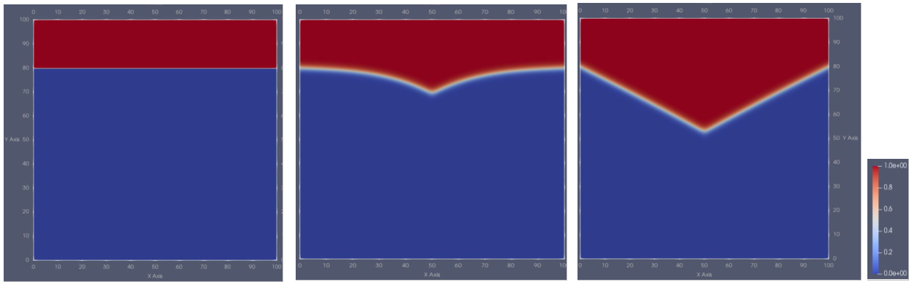

# Summary

Phase field method has emerged as a powerful computational tool for simulating  complex, evolving interfaces at mesoscale  in materials science and engineering, fluid dynamics, cell migration and other fields. However, achieving scalability and efficiency for parallel simulations of multicomponent multiphase systems across diverse hardware architectures remains a challenge.  This paper presents PhaseFieldPet, an open-source, message passing interface (mpi) based software package for large-scale phase field simulations, specifically designed to leverage heterogeneous architectures such as CPUs  and GPUs. It is built upon the Portable, Extensible Toolkit for Scientific Computation (PETSc). The software's modular design facilitates and easily integrates various phase field models such as Multiphase-Field and Multi-Order Parameter models with various choice of gradient and potential energy contributions.

# Phase Field Equation

The phase-field approach  represents surfaces and interfaces implicitly using continuous scalar fields (order parameter) $\phi_{\alpha}(\mathbf{r},t)$, $\alpha  \in \{1, 2, \ldots, N\}$, which are constant in bulk phases and with smooth transition across the interface. The order parameters $\phi_{\alpha}(\mathbf{r},t)$  represent different grains or  phases such as solid, liquid, gas and their state like  crystallographic orientation, polarization, volume fraction. For example, in a solid-solid phase transition, a solid phase can be represented by N order parameters $\phi_{\alpha}(\mathbf{r},t)$ based on N  crystallographic orientations or grains.

Microstructure evolution, and hence evolution of order parameter $\phi_{\alpha}(\mathbf{r},t)$ can be obtained  from functionals of entropy, or free energy, or grand potential [@Hötzer:2018]. Following an energy approach, one can write the total free energy functional of the system as
$$\mathcal{F}(\phi,\nabla\phi,...) =\int_{v} f dv=  \int_{v} f_\mathrm{grad}(\phi,\nabla\phi) + f_\mathrm{pot}(\phi) + f_\mathrm{bulk}(\phi,...)\, dv.$$

There exists various formulations to $f_\mathrm{grad}(\phi,\nabla\phi)$  and $f_\mathrm{pot}(\phi)$  by many scholars in the phase field community [@Daubner:2023]. As an example, @Nestler:2005 formulate these terms as

$$f_\mathrm{grad}(\phi,\nabla\phi)=\varepsilon \sum_{\alpha} \sum_{\beta > \alpha} \gamma_{\alpha \beta} |\phi_{\alpha} \nabla \phi_{\beta} - \phi_{\beta} \nabla  \phi_{\alpha}|^2 ,$$
$$f_\mathrm{pot}(\phi)=\frac{16}{\varepsilon {\pi}^2}\sum_{\alpha} \sum_{\beta > \alpha} \gamma_{\alpha \beta} \phi_{\alpha} \phi_{\beta} + \frac{1}{\varepsilon}\sum_{\alpha} \sum_{\beta > \alpha} \sum_{\delta > \beta} \gamma_{\alpha \beta \delta} \phi_{\alpha} \phi_{\beta} \phi_{\gamma}.$$

See @Daubner:2023 table B.4 for other formulations of these terms  and their explanations currently considered in PhaseFieldPet. The bulk  contribution $f_\mathrm{bulk}(\phi,...)$ can be of various type depending on the problem at hand  such as chemical, thermal, mechanical, electrical, magnetic and etc.

Following total energy minimization principle of the system, the phase field evolution equations for each $\phi_{\alpha}(\mathbf{r},t)$ are in general derived by variational derivatives of the functional $\mathcal{F}(\phi,\nabla\phi,...)$ and are  given by Allen-Cahn or time-dependent Ginzburg–Landau equations for each order parameter by

  $$\frac{\partial \phi_{\alpha}}{\partial t} = -L\frac{\delta\mathcal{F}}{\delta{\phi}_\alpha} = -L \left(\frac{\partial f}{\partial\phi_{\alpha}} - \nabla \cdot \frac{\partial f}{\partial\nabla\phi_{\alpha}}\right),$$

where $\textit{L}$ is kinetic coefficient. The resulting set of nonlinear parabolic differential equations define the multi-order parameter  (MOP) phase-field model and are selected in PhaseFieldPet via option `pfe_mop`.\

Multiphase-field models restrict the phase fields such that $\phi_{\alpha}(\mathbf{r},t) \in [0,1]$, $\sum_{\alpha} \phi_{\alpha} =1$. @Nestler:2005 introduced a Lagrange multiplier $\lambda$ to restrict the summation, yielding Allen-Cahn type Phase field equation

 $$\frac{\partial \phi_{\alpha}}{\partial t} = -L \left(\frac{\partial f}{\partial\phi_{\alpha}} - \nabla \cdot \frac{\partial f}{\partial\nabla\phi_{\alpha}}\right) + \lambda.$$
This is Lagrangian based Multiphase-field model (`mpfl`), and is chosen in PhaseFieldPet by `pfe_mpfl`. @Steinbach:1999 rewrote the phasefield evolution equations by the sum of binary interactions

$$\frac{\partial\phi_{\alpha}}{\partial t} = -\frac{1}{\tilde{N}\epsilon}\sum_{\beta\ne\alpha}^{\tilde{N}}M_{\alpha\beta}\left(\frac{\delta\mathcal F}{\delta\phi_{\alpha}}-\frac{\delta\mathcal F}{\delta\phi_{\beta}}\right),$$
where $M_{\alpha\beta}$ is a mobility matrix. This Multiphase-field model (`mpf`), is chosen in PhaseFieldPet via `pfe_mpf`.

We refer interested readers to @Daubner:2023, @Moelans:2008 and chapter seven of the book by @Provatas:2010 for a detailed overview of various phase-field formulations and associated evolution equations.

# Statement of need

For the past couple of decades, phase-field software has been being developed and used with  in house codes, and open source phase field software started to be available from 2007 [@Hong:2020]. Many  existing open source software are limited to one or two spatial dimensions, focus on binary systems, use  only one  type time step solver (usually explicit time stepping), work only on one CPU core (serial code) or are not capable of using heterogeneous compute resources available such as GPUs  for compute and energy efficiency. Notable large scale, distributed computing capable open source phase-field software that mainly target CPUs include: MOOSE [@schwen2023phasefield:2017], PRISMS-PF [@DeWitt:2020], OpenPhase [@Tegeler:2017], MicroSim [@Dutta:2025]. Among proprietary, distributed machines capable software is PACE3D [@Hötzer:2018]. \autoref{table:1} below gives a comparison of selected state of the art software for  Allen-Cahn  (and variations thereof) type phase-field  model solvers with online tutorial available, able to run on distributed - large scale hardware architectures.

\begin{table}[h!]
\centering
\includegraphics[width=0.8\textwidth]{table.png}
\caption{Actively developed MPI-capable phase-field software.}
\label{table:1}
\end{table}

PhaseFieldPet is a finite difference method (FDM) based software built on top of Time Step (TS) solver from PETSc [@Abhyankar:2018]. It is based on the previous work [@Daubner:2023] including all the different model formulations compared therein. PhaseFieldPet extends the numerical solutions to 3D, an arbitrary amount of N phases and includes various bulk driving forces according to @Hoffrogge:2025. It fills the aforementioned gaps in existing software by combining the following features:

1. Enabling of multiphase simulations in 1D / 2D / 3D.

2. Decoupling the numerical solution methods from the physical modeling such that one can choose various solution methods without restricting to one time step solver (i.e. one can use methods like semi implicit, implicit time stepping algorithms, various underlying nonlinear solver, linear solvers and preconditioners, etc) based on composability features of PETSc [@petsc-web-page:2024].

3. Executable  on single core, multicore to  multi node High Performance Computing clusters/supercomputers coupled with accelerators such as GPUs [@Mills:2021].

4. Flexibility to easily switch between various phase-field models and energy contributions at run time.

# Usage
To use PhaseFieldPet, PETSc [@petsc-web-page:2024] needs to be installed, compiled using\
     &nbsp;&nbsp;&nbsp; `make PhaseFieldPet`\
run the executable generated with `mpiexec`/`mpirun`/`srun` or similar other tools. For example using mpiexec with 4 mpi processes:\
     &nbsp;&nbsp;&nbsp; `mpiexec -n 4 PhaseFieldPet [options]`,\
where options can be various gradient, potential, bulk energy contributions or numerical methods used to solve.
For details of usage and examples, including your own energy contributions, see the associated [GitHub](https://github.com/ShoreSalle/PhaseFieldPet) to this paper.

## Example Result
\autoref{fig:example} shows a PhaseFieldPet result  of static triple junctions on 256 x 256 x 3 grids using adaptive Backward Euler  (fully implicit) time step solver and `-grad_dot -pot_toth -pfe_mpfl` options. See [GitHub](https://github.com/ShoreSalle/PhaseFieldPet) for scalability results.

{ width=100% height=100%}

# Conclusions
PhaseFieldPet provides users with flexible  methods to solve multiphase-field equations, along with various energy contributions on heterogeneous  hardware architectures including CPUs and GPUs.  More specifically, a  user can include specific gradient, potential, bulk driving energy terms and choose the type of the phase field equation, and type of numerical algorithm to use in order to  solve the differential equation. Inline with  PACE3D software [@Hötzer:2018] and its extension, the future version of PhaseFieldPet will  include various other modules corresponding to different applications of general multiphysics multiphase-field methods.

# Acknowledgement

We acknowledge discussions with Dr. Simon Daubner during the genesis of this project. The authors are grateful for the scientific support and HPC resources provided by the Erlangen National High Performance Computing Center (NHR@FAU) of the Friedrich-Alexander-Universität Erlangen-Nürnberg (FAU). The hardware is funded by the German Research Foundation (DFG).

# Funding

The author SSC thanks the [NHR-Verein e.V](www.nhr-verein.de) for supporting this work/project within the NHR Graduate School of National High Performance Computing (NHR). Furthermore, DS and BN acknowledge support from the Helmholtz association within programme MTET, no.38.04.04.

# References

